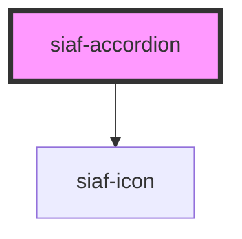

# siaf-accordion

<!-- Auto Generated Below -->

## Overview

accordion/base (UI Kit 15458:113).
Spec: h48 · pad 4/16 · gap 8 · leading expand Icon button 40 · title subtitle2 14 Medium · trailing more_vert 40.
Body es extensión WC (Kit base = head); no inventar chrome del head.

## Properties

| Property       | Attribute       | Description                                                   | Type      | Default |
| -------------- | --------------- | ------------------------------------------------------------- | --------- | ------- |
| `heading`      | `heading`       |                                                               | `string`  | `''`    |
| `open`         | `open`          |                                                               | `boolean` | `false` |
| `showTrailing` | `show-trailing` | Muestra Icon button trailing (more_vert). Default Kit = true. | `boolean` | `true`  |

## Events

| Event               | Description | Type                   |
| ------------------- | ----------- | ---------------------- |
| `siafToggle`        |             | `CustomEvent<boolean>` |
| `siafTrailingClick` |             | `CustomEvent<void>`    |

## Slots

| Slot        | Description      |
| ----------- | ---------------- |
|             | The default slot |
| `"summary"` |                  |

## Dependencies

### Depends on

- [siaf-icon](../siaf-icon)

### Graph

----------------------------------------------

*Built with [StencilJS](https://stenciljs.com/)*
