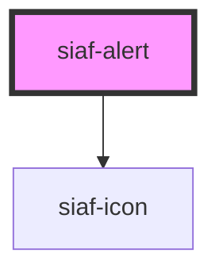

# siaf-alert

<!-- Auto Generated Below -->

## Overview

Alerta institucional SIAF-RP (UI Kit · Alerts).
Medido: pad 16, radius 8, h~68, gap 8, título 14 Bold, mensaje 12, sin borde.

## Properties

| Property   | Attribute   | Description                            | Type                                                        | Default    |
| ---------- | ----------- | -------------------------------------- | ----------------------------------------------------------- | ---------- |
| `role`     | `role`      |                                        | `"alert" \| "status"`                                       | `'status'` |
| `showIcon` | `show-icon` | Si false, no muestra ícono por defecto | `boolean`                                                   | `true`     |
| `tone`     | `tone`      |                                        | `"danger" \| "info" \| "neutral" \| "success" \| "warning"` | `'info'`   |

## Slots

| Slot      | Description                                  |
| --------- | -------------------------------------------- |
|           | Contenido / mensaje                          |
| `"icon"`  | Ícono opcional (reemplaza el glifo por tono) |
| `"title"` | Título opcional                              |

## Dependencies

### Depends on

- [siaf-icon](../siaf-icon)

### Graph

----------------------------------------------

*Built with [StencilJS](https://stenciljs.com/)*
