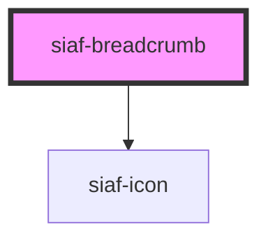

# siaf-breadcrumb

<!-- Auto Generated Below -->

## Overview

Breadcrumb SIAF (UI Kit · 7118:19582).
Spec: h=40, padding 4/16, gap 4, font 12, home Icon button 32.

## Properties

| Property   | Attribute   | Description                               | Type                    | Default     |
| ---------- | ----------- | ----------------------------------------- | ----------------------- | ----------- |
| `homeHref` | `home-href` | Kit siempre inicia con Icon buttons home. | `string \| undefined`   | `undefined` |
| `items`    | `items`     |                                           | `SiafCrumb[] \| string` | `[]`        |
| `showHome` | `show-home` |                                           | `boolean`               | `true`      |

## Events

| Event          | Description | Type                     |
| -------------- | ----------- | ------------------------ |
| `siafNavigate` |             | `CustomEvent<SiafCrumb>` |

## Slots

| Slot | Description      |
| ---- | ---------------- |
|      | The default slot |

## Dependencies

### Depends on

- [siaf-icon](../siaf-icon)

### Graph

----------------------------------------------

*Built with [StencilJS](https://stenciljs.com/)*
