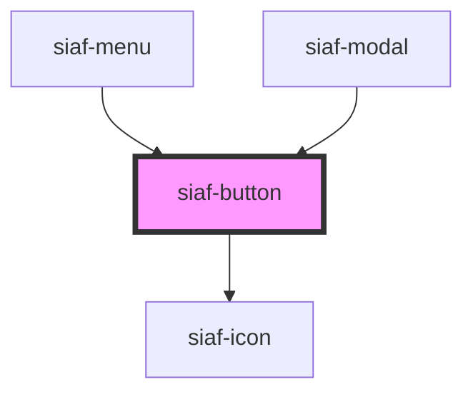

# siaf-button

<!-- Auto Generated Below -->

## Overview

Botón institucional SIAF-RP (UI Kit · Buttons, node 8305:2071).
Filled = brand accent · Outline/Text = neutral · Default 40 · Small 32 · gap 8 · Icon 24.
color=primary en Filled mapea al Filled del Kit (accent), no a brand-primary azul.

## Properties

| Property    | Attribute    | Description                                                             | Type                                               | Default     |
| ----------- | ------------ | ----------------------------------------------------------------------- | -------------------------------------------------- | ----------- |
| `ariaLabel` | `aria-label` |                                                                         | `string \| undefined`                              | `undefined` |
| `color`     | `color`      | En Filled, `primary` ≡ Kit Filled (accent). Outline/Text Kit = neutral. | `"accent" \| "danger" \| "primary" \| "secondary"` | `'primary'` |
| `disabled`  | `disabled`   |                                                                         | `boolean`                                          | `false`     |
| `icon`      | `icon`       | Nombre de ícono SIAF a la izquierda (alternativa al slot leading)       | `string \| undefined`                              | `undefined` |
| `iconEnd`   | `icon-end`   | Nombre de ícono SIAF a la derecha                                       | `string \| undefined`                              | `undefined` |
| `size`      | `size`       |                                                                         | `"md" \| "sm"`                                     | `'md'`      |
| `type`      | `type`       |                                                                         | `"button" \| "reset" \| "submit"`                  | `'button'`  |
| `variant`   | `variant`    |                                                                         | `"filled" \| "outlined" \| "text"`                 | `'filled'`  |

## Events

| Event       | Description | Type                      |
| ----------- | ----------- | ------------------------- |
| `siafClick` |             | `CustomEvent<MouseEvent>` |

## Slots

| Slot         | Description                      |
| ------------ | -------------------------------- |
|              | Etiqueta del botón               |
| `"leading"`  | Ícono / contenido a la izquierda |
| `"trailing"` | Ícono / contenido a la derecha   |

## Dependencies

### Used by

 - [siaf-menu](../siaf-menu)
 - [siaf-modal](../siaf-modal)

### Depends on

- [siaf-icon](../siaf-icon)

### Graph

----------------------------------------------

*Built with [StencilJS](https://stenciljs.com/)*
