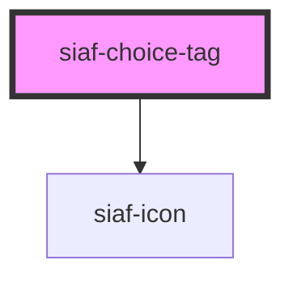

# siaf-choice-tag

<!-- Auto Generated Below -->

## Overview

Choice tags (UI Kit · 2. Choice tags · node 12482:857).
Emite siafSelect al click; no auto-toggle interno.

## Properties

| Property   | Attribute  | Description | Type                    | Default      |
| ---------- | ---------- | ----------- | ----------------------- | ------------ |
| `disabled` | `disabled` |             | `boolean`               | `false`      |
| `icon`     | `icon`     |             | `string \| undefined`   | `undefined`  |
| `label`    | `label`    |             | `string \| undefined`   | `undefined`  |
| `selected` | `selected` |             | `boolean`               | `false`      |
| `size`     | `size`     |             | `"small" \| "standard"` | `'standard'` |

## Events

| Event        | Description | Type                      |
| ------------ | ----------- | ------------------------- |
| `siafSelect` |             | `CustomEvent<MouseEvent>` |

## Slots

| Slot | Description      |
| ---- | ---------------- |
|      | The default slot |

## Shadow Parts

| Part    | Description |
| ------- | ----------- |
| `"tag"` |             |

## Dependencies

### Depends on

- [siaf-icon](../siaf-icon)

### Graph

----------------------------------------------

*Built with [StencilJS](https://stenciljs.com/)*
