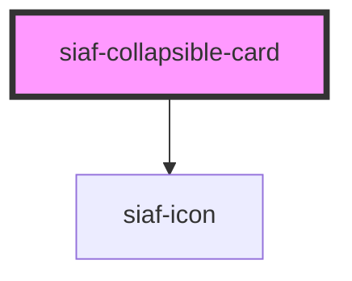

# siaf-collapsible-card

<!-- Auto Generated Below -->

## Overview

accordion/collapsible_card (UI Kit 19632:66).
Spec OPENED: header h60 · pad 8/24 · gap 16 · indicator 3×24 brand primary ·
icon buttons 32 (icon 20) · body pad 16/24 gap 24 · radius 8 · stroke divider.

## Properties

| Property    | Attribute    | Description | Type      | Default |
| ----------- | ------------ | ----------- | --------- | ------- |
| `heading`   | `heading`    |             | `string`  | `''`    |
| `open`      | `open`       |             | `boolean` | `true`  |
| `showClose` | `show-close` |             | `boolean` | `true`  |

## Events

| Event        | Description | Type                   |
| ------------ | ----------- | ---------------------- |
| `siafClose`  |             | `CustomEvent<void>`    |
| `siafToggle` |             | `CustomEvent<boolean>` |

## Slots

| Slot     | Description      |
| -------- | ---------------- |
|          | The default slot |
| `"info"` |                  |

## Shadow Parts

| Part       | Description |
| ---------- | ----------- |
| `"body"`   |             |
| `"card"`   |             |
| `"header"` |             |

## Dependencies

### Depends on

- [siaf-icon](../siaf-icon)

### Graph

----------------------------------------------

*Built with [StencilJS](https://stenciljs.com/)*
