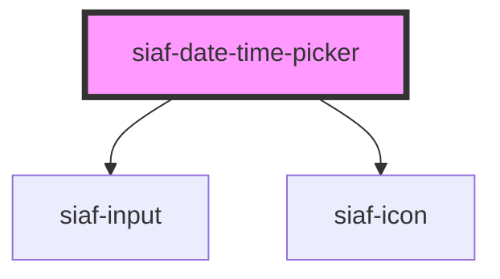

# siaf-date-time-picker

<!-- Auto Generated Below -->

## Overview

Date & time pickers · Calendar Type=Default (Kit `2097:989`).
Panel 268 · pad 8 · gap 8 · r8 · Day 36 (Selected/Today corner 40 · brand).

## Properties

| Property   | Attribute  | Description | Type                                   | Default     |
| ---------- | ---------- | ----------- | -------------------------------------- | ----------- |
| `disabled` | `disabled` |             | `boolean`                              | `false`     |
| `label`    | `label`    |             | `string \| undefined`                  | `undefined` |
| `mode`     | `mode`     |             | `"date" \| "datetime-local" \| "time"` | `'date'`    |
| `open`     | `open`     |             | `boolean`                              | `false`     |
| `value`    | `value`    |             | `string`                               | `''`        |

## Events

| Event        | Description | Type                  |
| ------------ | ----------- | --------------------- |
| `siafChange` |             | `CustomEvent<string>` |

## Dependencies

### Depends on

- [siaf-input](../siaf-input)
- [siaf-icon](../siaf-icon)

### Graph

----------------------------------------------

*Built with [StencilJS](https://stenciljs.com/)*
