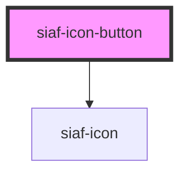

# siaf-icon-button

<!-- Auto Generated Below -->

## Overview

Icon buttons (UI Kit · node 8307:5607).
Filled = brand accent · Outline/Standard = neutral · Default 40 · Small 32.

## Properties

| Property                 | Attribute    | Description | Type                                  | Default     |
| ------------------------ | ------------ | ----------- | ------------------------------------- | ----------- |
| `activated`              | `activated`  |             | `boolean`                             | `false`     |
| `ariaLabel` _(required)_ | `aria-label` |             | `string`                              | `undefined` |
| `disabled`               | `disabled`   |             | `boolean`                             | `false`     |
| `icon` _(required)_      | `icon`       |             | `string`                              | `undefined` |
| `size`                   | `size`       |             | `"md" \| "sm"`                        | `'md'`      |
| `type`                   | `type`       |             | `"button" \| "reset" \| "submit"`     | `'button'`  |
| `variant`                | `variant`    |             | `"filled" \| "outline" \| "standard"` | `'filled'`  |

## Events

| Event       | Description | Type                      |
| ----------- | ----------- | ------------------------- |
| `siafClick` |             | `CustomEvent<MouseEvent>` |

## Dependencies

### Depends on

- [siaf-icon](../siaf-icon)

### Graph

----------------------------------------------

*Built with [StencilJS](https://stenciljs.com/)*
