# siaf-icon

<!-- Auto Generated Below -->

## Overview

Ícono SIAF (UI Kit · Material Symbols paths).
Uso: `<siaf-icon name="info" size="lg"></siaf-icon>`
Slot: SVG custom tiene prioridad sobre `name`.

## Properties

| Property    | Attribute    | Description                                                        | Type                                            | Default     |
| ----------- | ------------ | ------------------------------------------------------------------ | ----------------------------------------------- | ----------- |
| `ariaLabel` | `aria-label` | Etiqueta accesible; si falta, el ícono es decorativo (aria-hidden) | `string \| undefined`                           | `undefined` |
| `name`      | `name`       | Nombre del glifo del set institucional                             | `string \| undefined`                           | `undefined` |
| `size`      | `size`       |                                                                    | `"lg" \| "md" \| "sm" \| "xl" \| "xs" \| "xxl"` | `'md'`      |

## Slots

| Slot | Description      |
| ---- | ---------------- |
|      | The default slot |

## Shadow Parts

| Part      | Description |
| --------- | ----------- |
| `"glyph"` |             |

## Dependencies

### Used by

 - [siaf-accordion](../siaf-accordion)
 - [siaf-action-tag](../siaf-action-tag)
 - [siaf-alert](../siaf-alert)
 - [siaf-breadcrumb](../siaf-breadcrumb)
 - [siaf-button](../siaf-button)
 - [siaf-choice-tag](../siaf-choice-tag)
 - [siaf-collapsible-card](../siaf-collapsible-card)
 - [siaf-date-time-picker](../siaf-date-time-picker)
 - [siaf-icon-button](../siaf-icon-button)
 - [siaf-input-tag](../siaf-input-tag)
 - [siaf-kpi-card](../siaf-kpi-card)
 - [siaf-loading-progress](../siaf-loading-progress)
 - [siaf-modal](../siaf-modal)
 - [siaf-navbar](../siaf-navbar)
 - [siaf-pagination](../siaf-pagination)
 - [siaf-readonly](../siaf-readonly)
 - [siaf-record-status-tag](../siaf-record-status-tag)
 - [siaf-side-panel](../siaf-side-panel)
 - [siaf-snackbar](../siaf-snackbar)
 - [siaf-status-tag](../siaf-status-tag)
 - [siaf-steps](../siaf-steps)
 - [siaf-tag](../siaf-tag)
 - [siaf-uploaded-file-card](../siaf-uploaded-file-card)
 - [siaf-uploader](../siaf-uploader)

### Graph

```mermaid
graph TD;
  siaf-accordion --> siaf-icon
  siaf-action-tag --> siaf-icon
  siaf-alert --> siaf-icon
  siaf-breadcrumb --> siaf-icon
  siaf-button --> siaf-icon
  siaf-choice-tag --> siaf-icon
  siaf-collapsible-card --> siaf-icon
  siaf-date-time-picker --> siaf-icon
  siaf-icon-button --> siaf-icon
  siaf-input-tag --> siaf-icon
  siaf-kpi-card --> siaf-icon
  siaf-loading-progress --> siaf-icon
  siaf-modal --> siaf-icon
  siaf-navbar --> siaf-icon
  siaf-pagination --> siaf-icon
  siaf-readonly --> siaf-icon
  siaf-record-status-tag --> siaf-icon
  siaf-side-panel --> siaf-icon
  siaf-snackbar --> siaf-icon
  siaf-status-tag --> siaf-icon
  siaf-steps --> siaf-icon
  siaf-tag --> siaf-icon
  siaf-uploaded-file-card --> siaf-icon
  siaf-uploader --> siaf-icon
  style siaf-icon fill:#f9f,stroke:#333,stroke-width:4px
```

----------------------------------------------

*Built with [StencilJS](https://stenciljs.com/)*
