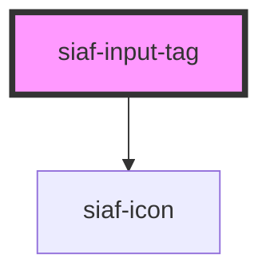

# siaf-input-tag

<!-- Auto Generated Below -->

## Overview

Input tags (UI Kit · 1. Input tags · node 12474:5170).

## Properties

| Property      | Attribute     | Description | Type                    | Default      |
| ------------- | ------------- | ----------- | ----------------------- | ------------ |
| `disabled`    | `disabled`    |             | `boolean`               | `false`      |
| `dismissible` | `dismissible` |             | `boolean`               | `true`       |
| `label`       | `label`       |             | `string \| undefined`   | `undefined`  |
| `selected`    | `selected`    |             | `boolean`               | `false`      |
| `size`        | `size`        |             | `"small" \| "standard"` | `'standard'` |

## Events

| Event         | Description | Type                |
| ------------- | ----------- | ------------------- |
| `siafDismiss` |             | `CustomEvent<void>` |

## Slots

| Slot | Description      |
| ---- | ---------------- |
|      | The default slot |

## Shadow Parts

| Part        | Description |
| ----------- | ----------- |
| `"dismiss"` |             |
| `"tag"`     |             |

## Dependencies

### Depends on

- [siaf-icon](../siaf-icon)

### Graph

----------------------------------------------

*Built with [StencilJS](https://stenciljs.com/)*
