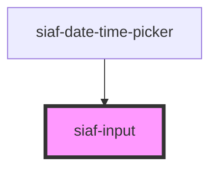

# siaf-input

<!-- Auto Generated Below -->

## Overview

Text fields SIAF-RP (UI Kit · node 7524:6726).
Size=Default: min-h 40, pad 8/16, radius 8, body 14.
Size=Compact: min-h 32.
Label: notch sobre el borde (caption 12 Medium), no encima del campo.

## Properties

| Property      | Attribute     | Description | Type                     | Default     |
| ------------- | ------------- | ----------- | ------------------------ | ----------- |
| `disabled`    | `disabled`    |             | `boolean`                | `false`     |
| `errorText`   | `error-text`  |             | `string \| undefined`    | `undefined` |
| `helperText`  | `helper-text` |             | `string \| undefined`    | `undefined` |
| `label`       | `label`       |             | `string \| undefined`    | `undefined` |
| `name`        | `name`        |             | `string \| undefined`    | `undefined` |
| `placeholder` | `placeholder` |             | `string \| undefined`    | `undefined` |
| `readonly`    | `readonly`    |             | `boolean`                | `false`     |
| `required`    | `required`    |             | `boolean`                | `false`     |
| `size`        | `size`        |             | `"compact" \| "default"` | `'default'` |
| `type`        | `type`        |             | `string`                 | `'text'`    |
| `value`       | `value`       |             | `string`                 | `''`        |

## Events

| Event        | Description | Type                  |
| ------------ | ----------- | --------------------- |
| `siafChange` |             | `CustomEvent<string>` |
| `siafInput`  |             | `CustomEvent<string>` |

## Slots

| Slot         | Description |
| ------------ | ----------- |
| `"leading"`  |             |
| `"trailing"` |             |

## Shadow Parts

| Part      | Description |
| --------- | ----------- |
| `"field"` |             |
| `"input"` |             |

## Dependencies

### Used by

 - [siaf-date-time-picker](../siaf-date-time-picker)

### Graph

----------------------------------------------

*Built with [StencilJS](https://stenciljs.com/)*
