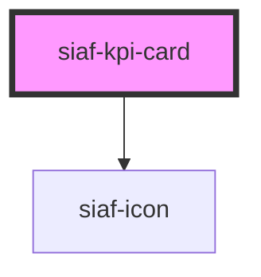

# siaf-kpi-card

<!-- Auto Generated Below -->

## Overview

KPI card (UI Kit · Graphics `22743:662`).
Spec: pad 24 · gap 12 · radius 8 · stroke rgba(32,32,32,.4) ·
label subtitle2 14 Medium · value heading4 22 Bold ·
Progress/lineal h8 + % body2 14 · icon-box 24 pad 4 radius 4.

## Properties

| Property    | Attribute    | Description                                | Type                                                  | Default           |
| ----------- | ------------ | ------------------------------------------ | ----------------------------------------------------- | ----------------- |
| `iconName`  | `icon-name`  |                                            | `string`                                              | `'arrow_outward'` |
| `iconStyle` | `icon-style` |                                            | `"danger" \| "informative" \| "success" \| "warning"` | `'informative'`   |
| `label`     | `label`      |                                            | `string`                                              | `''`              |
| `progress`  | `progress`   | 0–100; si se omite, no se muestra la barra | `number \| undefined`                                 | `undefined`       |
| `showIcon`  | `show-icon`  |                                            | `boolean`                                             | `true`            |
| `value`     | `value`      |                                            | `number \| string`                                    | `''`              |

## Slots

| Slot     | Description      |
| -------- | ---------------- |
|          | The default slot |
| `"icon"` |                  |

## Shadow Parts

| Part         | Description |
| ------------ | ----------- |
| `"icon"`     |             |
| `"kpi"`      |             |
| `"progress"` |             |
| `"value"`    |             |

## Dependencies

### Depends on

- [siaf-icon](../siaf-icon)

### Graph

----------------------------------------------

*Built with [StencilJS](https://stenciljs.com/)*
