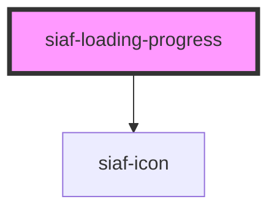

# siaf-loading-progress

<!-- Auto Generated Below -->

## Overview

Progress/lineal Kit 2611:1503 — track h8 · gap 16 · % 14 Regular · icon 24 opcional.

## Properties

| Property      | Attribute      | Description                   | Type                  | Default     |
| ------------- | -------------- | ----------------------------- | --------------------- | ----------- |
| `label`       | `label`        |                               | `string \| undefined` | `undefined` |
| `showPercent` | `show-percent` |                               | `boolean`             | `true`      |
| `value`       | `value`        | 0–100; omit for indeterminate | `number \| undefined` | `undefined` |

## Dependencies

### Depends on

- [siaf-icon](../siaf-icon)

### Graph

----------------------------------------------

*Built with [StencilJS](https://stenciljs.com/)*
