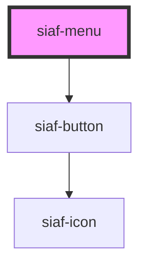

# siaf-menu

<!-- Auto Generated Below -->

## Properties

| Property  | Attribute | Description                              | Type                       | Default      |
| --------- | --------- | ---------------------------------------- | -------------------------- | ------------ |
| `density` | `density` | Standard h48 · Compact h32 (Kit Density) | `"compact" \| "standard"`  | `'standard'` |
| `items`   | `items`   |                                          | `SiafMenuItem[] \| string` | `[]`         |

## Events

| Event        | Description | Type                  |
| ------------ | ----------- | --------------------- |
| `siafSelect` |             | `CustomEvent<string>` |

## Slots

| Slot        | Description |
| ----------- | ----------- |
| `"trigger"` |             |

## Dependencies

### Depends on

- [siaf-button](../siaf-button)

### Graph

----------------------------------------------

*Built with [StencilJS](https://stenciljs.com/)*
