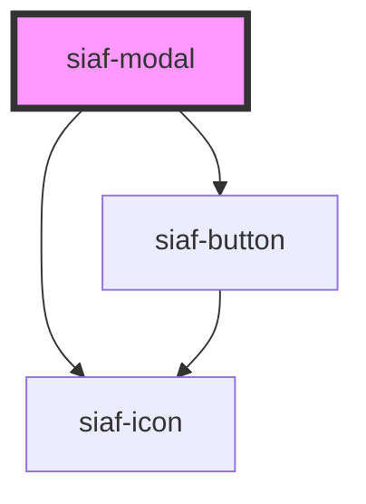

# siaf-modal

<!-- Auto Generated Below -->

## Overview

Modals - SIAF (Componentes Transversales).
Spec Figma Grabar: 500px, Modal interno radius 8, padding 48/24/24/24, gap 24.
a11y: dialog modal, Escape, focus trap, restore focus.

## Properties

| Property         | Attribute         | Description | Type      | Default      |
| ---------------- | ----------------- | ----------- | --------- | ------------ |
| `cancelLabel`    | `cancel-label`    |             | `string`  | `'Cancelar'` |
| `confirmActions` | `confirm-actions` |             | `boolean` | `false`      |
| `confirmLabel`   | `confirm-label`   |             | `string`  | `'Aceptar'`  |
| `heading`        | `heading`         |             | `string`  | `''`         |
| `open`           | `open`            |             | `boolean` | `false`      |
| `showClose`      | `show-close`      |             | `boolean` | `true`       |

## Events

| Event         | Description | Type                |
| ------------- | ----------- | ------------------- |
| `siafCancel`  |             | `CustomEvent<void>` |
| `siafClose`   |             | `CustomEvent<void>` |
| `siafConfirm` |             | `CustomEvent<void>` |

## Slots

| Slot             | Description      |
| ---------------- | ---------------- |
|                  | The default slot |
| `"footer"`       |                  |
| `"header"`       |                  |
| `"illustration"` |                  |

## Shadow Parts

| Part        | Description |
| ----------- | ----------- |
| `"actions"` |             |
| `"dialog"`  |             |
| `"footer"`  |             |
| `"scrim"`   |             |

## Dependencies

### Depends on

- [siaf-icon](../siaf-icon)
- [siaf-button](../siaf-button)

### Graph

----------------------------------------------

*Built with [StencilJS](https://stenciljs.com/)*
