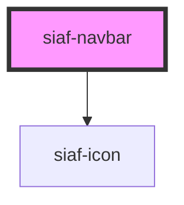

# siaf-navbar

<!-- Auto Generated Below -->

## Overview

Navbar Ver Transversales `5104:4022`:
h56 · pad 4/16 · Logo (menu 32 + logo 128, gap 24) · notif 32 · perfil (avatar 40 + name/office + chevron 24).

## Properties

| Property            | Attribute            | Description                                                    | Type      | Default                          |
| ------------------- | -------------------- | -------------------------------------------------------------- | --------- | -------------------------------- |
| `brand`             | `brand`              | Texto fallback si no hay slot brand ni logoSrc                 | `string`  | `'SIAF-RP'`                      |
| `logoAlt`           | `logo-alt`           |                                                                | `string`  | `'SiAF-RP'`                      |
| `logoSrc`           | `logo-src`           | Logo SIAF (Transversales · 128×40). Default asset del paquete. | `string`  | `'/assets/navbar/logo-siaf.svg'` |
| `showMenu`          | `show-menu`          | Mostrar toggle menú (Menu header 20 en hit 32)                 | `boolean` | `true`                           |
| `showNotifications` | `show-notifications` | Mostrar campana notifications 32                               | `boolean` | `true`                           |
| `userInitials`      | `user-initials`      |                                                                | `string`  | `''`                             |
| `userName`          | `user-name`          |                                                                | `string`  | `''`                             |
| `userOffice`        | `user-office`        |                                                                | `string`  | `''`                             |

## Events

| Event                    | Description | Type                |
| ------------------------ | ----------- | ------------------- |
| `siafMenuClick`          |             | `CustomEvent<void>` |
| `siafNotificationsClick` |             | `CustomEvent<void>` |
| `siafProfileClick`       |             | `CustomEvent<void>` |

## Slots

| Slot        | Description      |
| ----------- | ---------------- |
|             | The default slot |
| `"actions"` |                  |
| `"brand"`   |                  |
| `"menu"`    |                  |

## Shadow Parts

| Part              | Description |
| ----------------- | ----------- |
| `"actions"`       |             |
| `"brand"`         |             |
| `"menu"`          |             |
| `"nav"`           |             |
| `"notifications"` |             |
| `"profile"`       |             |

## Dependencies

### Depends on

- [siaf-icon](../siaf-icon)

### Graph

----------------------------------------------

*Built with [StencilJS](https://stenciljs.com/)*
