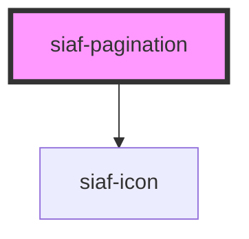

# siaf-pagination

<!-- Auto Generated Below -->

## Overview

Pagination SIAF (UI Kit `Pagination`, node 2506:7606).
Spec: h=40, gap 16, rango caption 12, Icon buttons 40×40 / icon 24.
Row page=True: label + Text fields (min-h 32, w 82, pad 16/4, r8, expand_more 24)
+ lista de opciones (composición Lists; no WC Select ni `<select>` nativo).

## Properties

| Property          | Attribute           | Description | Type                 | Default             |
| ----------------- | ------------------- | ----------- | -------------------- | ------------------- |
| `page`            | `page`              |             | `number`             | `1`                 |
| `pageSize`        | `page-size`         |             | `number`             | `25`                |
| `pageSizeOptions` | `page-size-options` |             | `number[] \| string` | `[10, 25, 50, 100]` |
| `showPageSize`    | `show-page-size`    |             | `boolean`            | `false`             |
| `totalItems`      | `total-items`       |             | `number`             | `0`                 |

## Events

| Event                | Description | Type                  |
| -------------------- | ----------- | --------------------- |
| `siafPageChange`     |             | `CustomEvent<number>` |
| `siafPageSizeChange` |             | `CustomEvent<number>` |

## Dependencies

### Depends on

- [siaf-icon](../siaf-icon)

### Graph

----------------------------------------------

*Built with [StencilJS](https://stenciljs.com/)*
