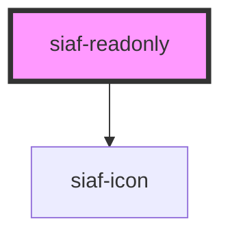

# siaf-readonly

<!-- Auto Generated Below -->

## Overview

Readonly Card SIAF-RP (UI Kit · 7008:36924).
Spec: gap 4 · label Overline 11 Medium uppercase · value row h24 gap 8 ·
value Text body2 14 Bold · trailing info 24 (default True) · leading 24 opcional.

## Properties

| Property           | Attribute            | Description                                 | Type                  | Default     |
| ------------------ | -------------------- | ------------------------------------------- | --------------------- | ----------- |
| `hint`             | `hint`               | Leyenda tipo "Precargado del CMN"           | `string \| undefined` | `undefined` |
| `inputs`           | `inputs`             | Inputs=Text (Bold) \| Comment (Regular)     | `"comment" \| "text"` | `'text'`    |
| `label`            | `label`              |                                             | `string \| undefined` | `undefined` |
| `leadingIcon`      | `leading-icon`       | Leading icon Kit default = False.           | `boolean`             | `false`     |
| `leadingIconName`  | `leading-icon-name`  |                                             | `string`              | `'info'`    |
| `trailingIcon`     | `trailing-icon`      | Trailing icon Kit default = True (info 24). | `boolean`             | `true`      |
| `trailingIconName` | `trailing-icon-name` |                                             | `string`              | `'info'`    |
| `value`            | `value`              |                                             | `string \| undefined` | `undefined` |

## Slots

| Slot         | Description      |
| ------------ | ---------------- |
|              | The default slot |
| `"leading"`  |                  |
| `"trailing"` |                  |

## Shadow Parts

| Part      | Description |
| --------- | ----------- |
| `"card"`  |             |
| `"value"` |             |

## Dependencies

### Depends on

- [siaf-icon](../siaf-icon)

### Graph

----------------------------------------------

*Built with [StencilJS](https://stenciljs.com/)*
