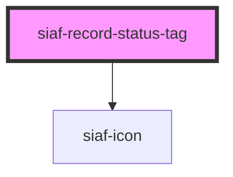

# siaf-record-status-tag

<!-- Auto Generated Below -->

## Overview

status register tags (UI Kit · `12800:5587`):
Small h24 · Standard h32 · radius 4 · pad 0/8 · gap 8 · icon 20 · caption 12
Soft feedback fill + border feedback + leading icon.

## Properties

| Property | Attribute | Description | Type                                                        | Default          |
| -------- | --------- | ----------- | ----------------------------------------------------------- | ---------------- |
| `icon`   | `icon`    |             | `string`                                                    | `'check_circle'` |
| `label`  | `label`   |             | `string \| undefined`                                       | `undefined`      |
| `size`   | `size`    |             | `"md" \| "sm"`                                              | `'sm'`           |
| `tone`   | `tone`    |             | `"danger" \| "info" \| "neutral" \| "success" \| "warning"` | `'info'`         |

## Slots

| Slot | Description      |
| ---- | ---------------- |
|      | The default slot |

## Shadow Parts

| Part    | Description |
| ------- | ----------- |
| `"tag"` |             |

## Dependencies

### Depends on

- [siaf-icon](../siaf-icon)

### Graph

----------------------------------------------

*Built with [StencilJS](https://stenciljs.com/)*
