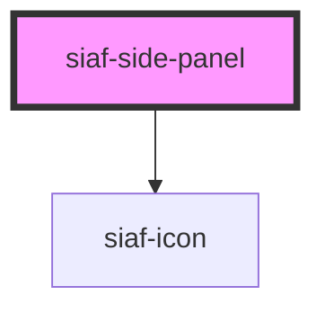

# siaf-side-panel

<!-- Auto Generated Below -->

## Overview

Side panel / drawer SIAF (Transversales).
a11y: dialog modal, Escape, focus trap, restore focus, body scroll lock.

## Properties

| Property  | Attribute | Description             | Type                | Default   |
| --------- | --------- | ----------------------- | ------------------- | --------- |
| `heading` | `heading` |                         | `string`            | `''`      |
| `open`    | `open`    |                         | `boolean`           | `false`   |
| `side`    | `side`    |                         | `"left" \| "right"` | `'right'` |
| `width`   | `width`   | Ancho Kit Sidenav = 370 | `string`            | `'370px'` |

## Events

| Event       | Description | Type                |
| ----------- | ----------- | ------------------- |
| `siafClose` |             | `CustomEvent<void>` |

## Slots

| Slot       | Description        |
| ---------- | ------------------ |
|            | Cuerpo             |
| `"footer"` | Acciones           |
| `"header"` | Título alternativo |

## Dependencies

### Depends on

- [siaf-icon](../siaf-icon)

### Graph

----------------------------------------------

*Built with [StencilJS](https://stenciljs.com/)*
