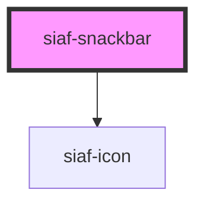

# siaf-snackbar

<!-- Auto Generated Below -->

## Overview

Snackbar SIAF (UI Kit).

## Properties

| Property   | Attribute   | Description | Type                                                        | Default     |
| ---------- | ----------- | ----------- | ----------------------------------------------------------- | ----------- |
| `duration` | `duration`  |             | `number`                                                    | `4000`      |
| `message`  | `message`   |             | `string`                                                    | `''`        |
| `open`     | `open`      |             | `boolean`                                                   | `false`     |
| `showIcon` | `show-icon` |             | `boolean`                                                   | `true`      |
| `tone`     | `tone`      |             | `"danger" \| "info" \| "neutral" \| "success" \| "warning"` | `'neutral'` |

## Events

| Event       | Description | Type                |
| ----------- | ----------- | ------------------- |
| `siafClose` |             | `CustomEvent<void>` |

## Slots

| Slot       | Description                   |
| ---------- | ----------------------------- |
|            | Mensaje                       |
| `"action"` | Acción opcional               |
| `"icon"`   | Ícono (reemplaza el del tono) |

## Shadow Parts

| Part      | Description |
| --------- | ----------- |
| `"toast"` |             |

## Dependencies

### Depends on

- [siaf-icon](../siaf-icon)

### Graph

----------------------------------------------

*Built with [StencilJS](https://stenciljs.com/)*
