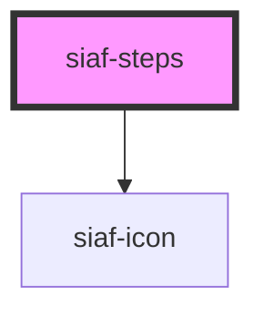

# siaf-steps

<!-- Auto Generated Below -->

## Overview

Steps PAC (UI Kit · Vertical stepper with status / Steps PAC).
Spec: indicador 24px, gap 16 entre indicador y texto, Size=Small.

## Properties

| Property      | Attribute     | Description                                                          | Type                         | Default      |
| ------------- | ------------- | -------------------------------------------------------------------- | ---------------------------- | ------------ |
| `current`     | `current`     | Índice 0-based del paso actual                                       | `number`                     | `0`          |
| `interactive` | `interactive` |                                                                      | `boolean`                    | `false`      |
| `orientation` | `orientation` | Kit Steps Rows = vertical. Horizontal solo si el consumidor lo pide. | `"horizontal" \| "vertical"` | `'vertical'` |
| `size`        | `size`        |                                                                      | `"default" \| "small"`       | `'small'`    |
| `steps`       | `steps`       |                                                                      | `SiafStep[] \| string`       | `[]`         |

## Events

| Event            | Description | Type                  |
| ---------------- | ----------- | --------------------- |
| `siafStepChange` |             | `CustomEvent<number>` |

## Shadow Parts

| Part      | Description |
| --------- | ----------- |
| `"step"`  |             |
| `"track"` |             |

## Dependencies

### Depends on

- [siaf-icon](../siaf-icon)

### Graph

----------------------------------------------

*Built with [StencilJS](https://stenciljs.com/)*
