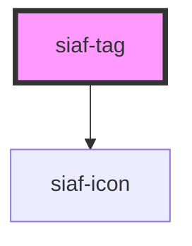

# siaf-tag

<!-- Auto Generated Below -->

## Overview

Filter tags (UI Kit · `12482:543` Selected):
Standard h32 pad 4/8 · Small h24 pad 0/8 · radius 8 · gap 8 · body2 14
Selected=True: check 20 + label + expand_more 20 · bg brand 8% · border/texto #014899

## Properties

| Property       | Attribute       | Description                                                         | Type                                                        | Default      |
| -------------- | --------------- | ------------------------------------------------------------------- | ----------------------------------------------------------- | ------------ |
| `label`        | `label`         |                                                                     | `string \| undefined`                                       | `undefined`  |
| `selected`     | `selected`      | Filter tags Selected=True → check + expand_more + colores activated | `boolean`                                                   | `false`      |
| `showLeading`  | `show-leading`  | Forzar/ocultar ícono leading (default: check si selected)           | `boolean \| undefined`                                      | `undefined`  |
| `showTrailing` | `show-trailing` | Forzar/ocultar ícono trailing (default: expand_more si selected)    | `boolean \| undefined`                                      | `undefined`  |
| `size`         | `size`          |                                                                     | `"small" \| "standard"`                                     | `'standard'` |
| `tone`         | `tone`          |                                                                     | `"danger" \| "info" \| "neutral" \| "success" \| "warning"` | `'neutral'`  |
| `variant`      | `variant`       |                                                                     | `"filled" \| "outlined" \| "soft"`                          | `'outlined'` |

## Slots

| Slot | Description      |
| ---- | ---------------- |
|      | The default slot |

## Shadow Parts

| Part         | Description |
| ------------ | ----------- |
| `"leading"`  |             |
| `"tag"`      |             |
| `"trailing"` |             |

## Dependencies

### Depends on

- [siaf-icon](../siaf-icon)

### Graph

----------------------------------------------

*Built with [StencilJS](https://stenciljs.com/)*
