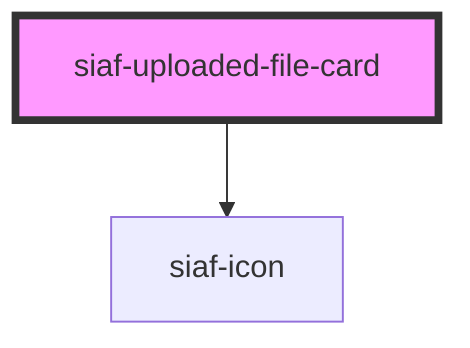

# siaf-uploaded-file-card

<!-- Auto Generated Below -->

## Overview

Kit Uploader · `upload` Estado=Done|Failed (`2612:2115` / `2612:9065`).
pad 16 · radius 8 · stroke 1 · row gap 12 · xls_file 32 · actions 24 (repeat + cancel).

## Properties

| Property   | Attribute   | Description                                        | Type                                | Default     |
| ---------- | ----------- | -------------------------------------------------- | ----------------------------------- | ----------- |
| `fileName` | `file-name` |                                                    | `string`                            | `''`        |
| `meta`     | `meta`      |                                                    | `string \| undefined`               | `undefined` |
| `status`   | `status`    | Done \| Failed (stroke/texto danger cuando Failed) | `"done" \| "failed" \| "uploading"` | `'done'`    |

## Events

| Event        | Description | Type                |
| ------------ | ----------- | ------------------- |
| `siafRemove` |             | `CustomEvent<void>` |
| `siafRetry`  |             | `CustomEvent<void>` |

## Slots

| Slot | Description      |
| ---- | ---------------- |
|      | The default slot |

## Dependencies

### Depends on

- [siaf-icon](../siaf-icon)

### Graph

----------------------------------------------

*Built with [StencilJS](https://stenciljs.com/)*
