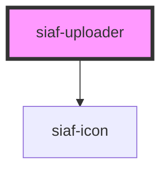

# siaf-uploader

<!-- Auto Generated Below -->

## Overview

many upload Kit 2608:17555 — extend=true Default.

## Properties

| Property   | Attribute  | Description | Type                  | Default                                       |
| ---------- | ---------- | ----------- | --------------------- | --------------------------------------------- |
| `accept`   | `accept`   |             | `string \| undefined` | `undefined`                                   |
| `disabled` | `disabled` |             | `boolean`             | `false`                                       |
| `hint`     | `hint`     |             | `string`              | `'Se permiten archivos de 10 MB como máximo'` |
| `label`    | `label`    |             | `string`              | `'Arrastrar o elige archivo del computador'`  |
| `multiple` | `multiple` |             | `boolean`             | `false`                                       |

## Events

| Event       | Description | Type                    |
| ----------- | ----------- | ----------------------- |
| `siafFiles` |             | `CustomEvent<FileList>` |

## Dependencies

### Depends on

- [siaf-icon](../siaf-icon)

### Graph

----------------------------------------------

*Built with [StencilJS](https://stenciljs.com/)*
